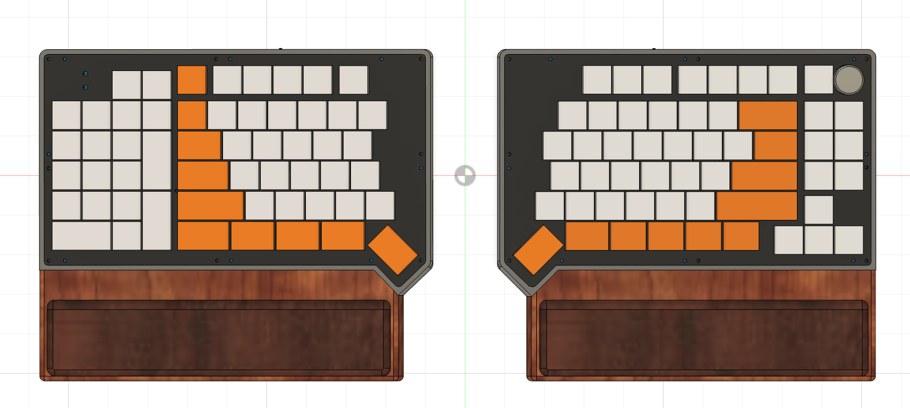
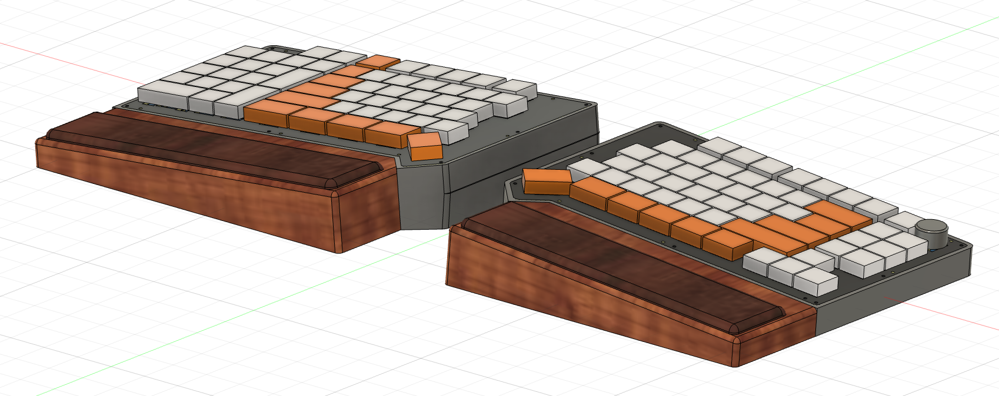

# ksn3-firmware

ZMK firmware configuration for the KSN-3 split keyboard. This is a **new board**, built from scratch by reverse-engineering the KSN-3 EasyEDA schematic (`SCH_KSN3L_20260831.json` / `SCH_KSN3R_20260831.json`) and porting the driver architecture, build-system structure, and hard-won operational lessons from [ksn1-firmware](https://github.com/Kesaros44/ksn1-firmware).

* Keyboard Maintainer: [AJG](https://github.com/Kesaros44)
* Hardware Supported: KSN-3 split keyboard, nice!nano v2 (nRF52840), BLE




## ⚠️ Read this before flashing

This repo has **not been tested on physical hardware yet**. It splits into two confidence levels:

- **High confidence — derived directly from the schematic, double-checked two independent ways** (manual visual reading of the rendered schematic images, and programmatic coordinate-matching of the raw EasyEDA JSON, with full agreement): every row/col GPIO pin, the encoder's GPIO pins and matrix role, which half the two status LEDs are wired to, and which half is central. These are the parts most likely to cause a *non-working board* if wrong, and they're the parts I'm most sure of.
- **My judgment call, needs your review — the keymap's specific key assignments.** The *physical switch positions* (which matrix cell is where) come straight from the schematic and are solid. But *what key each position sends* (`config/ksn_3.keymap`) is a first draft I wrote by inference from position/shape, not from a labelled keycap layout — I do not know what's silkscreened on your actual keycaps or plate. Treat the keymap as a working starting point, not a final answer: flash it, check it against the physical board, and re-flash after edits. No hardware risk either way — a wrong keycode is just an inconvenience, not a wiring problem.

One item flagged inline in the devicetree itself: `status_led` (COND) is set to `GPIO_ACTIVE_HIGH` as a first guess. KSN-1 had this exact LED inverted (lit when it should've been dark) and needed `GPIO_ACTIVE_LOW` instead — if KSN-3's status LED looks backwards after flashing, that's the first thing to flip (`config/boards/shields/ksn_3/ksn_3_left.overlay`).

## Hardware

- **MCU:** nice!nano v2 (nRF52840) per half, wireless (BLE)
- **Central:** the **right** half (matches the switch matrix layout — no `POS_STATE_LEN` overflow risk like KSN-1 originally had, since KSN-3's matrix is 6×22, same size as KSN-1's corrected layout)
- **Matrix:** 6 rows x 22 columns combined (11 columns per half, 55 switches on the left / 54 on the right), `col2row`
- **Encoder:** one EC11 encoder on the right half (central) only, with its pushbutton (SW50) wired into the matrix itself (row1/col10 on the right half) rather than a separate GPIO — treat it as an ordinary key in the keymap, not a special encoder-click binding
- **LEDs (left/peripheral only):** a Caps Lock LED (P0.02) and a BLE connection-status LED (P0.29, labelled COND on the schematic), each driven by a custom driver (see below) rather than ZMK's built-in indicator node
- **Backlight:** the schematic has a populated MOSFET switching circuit (Q1 + gate resistors) on both halves, same as KSN-2, so backlight is **enabled** by default here (unlike KSN-1, which ships with it off by request). Set `CONFIG_ZMK_BACKLIGHT=n` in both `.conf` files if you want it off like KSN-1.
- **RGB underglow:** not present on this board (`CONFIG_ZMK_RGB_UNDERGLOW=n`)
- **Battery:** reporting enabled on both halves; central also periodically fetches the peripheral's battery level and reports it to the host alongside its own (`CONFIG_ZMK_SPLIT_BLE_CENTRAL_BATTERY_LEVEL_FETCHING`/`_PROXY`, with `CONFIG_ZMK_SPLIT_BLE_CENTRAL_PERIPHERALS=1` set explicitly — see the KSN-2 lesson below)

### Custom LED drivers (why they exist)

Identical rationale to KSN-1: ZMK's built-in `zmk,indicator-leds` devicetree node calls central-only functions (`zmk_hid_indicators_get_current_profile()`, `zmk_endpoint_is_connected()`), which aren't linkable on a peripheral build — but both of this board's status LEDs are physically wired to the peripheral (left) half. Two custom drivers, ported near-verbatim from ksn1-firmware, work around this:

- **`ksn3_peripheral_indicators.c`** — drives the Caps Lock LED by subscribing to the `zmk_hid_indicators_changed` event instead, which *is* safe on a peripheral (central pushes the host's raw HID indicator bitmask over BLE when `CONFIG_ZMK_SPLIT_PERIPHERAL_HID_INDICATORS=y` is set on both sides).
- **`ksn3_conn_status_relay_central.c`** / **`ksn3_conn_status_relay_peripheral.c`** — there's no built-in ZMK channel for "does central have an active host connection" on a peripheral LED, so these add a private BLE GATT service (freshly generated UUIDs, distinct from KSN-1's) on top of the existing split link: central polls `zmk_endpoint_is_connected()` every 250ms and writes a byte to the peripheral over that private characteristic whenever it changes; the peripheral drives the LED solid when connected, blinking (300ms) when not. GATT discovery for this side-channel is deliberately delayed 3s after a split reconnect so it doesn't compete with ZMK's own critical-path discovery (position state, indicators, battery) for the connection's single-outstanding-ATT-request slot.

All three files are wired into the build via `config/zephyr/module.yml` (registers `config/` as a Zephyr module) + `config/CMakeLists.txt` (`target_sources(app PRIVATE src/...)`, paths relative to `config/`) + the source files under `config/src/`. If you ever add another custom `.c` file here, all three have to agree — a missing or misplaced piece silently compiles the file out with no build error.

Unlike KSN-1/KSN-2, this repo's `config/west.yml` does **not** pull in the old `zmk-poor-mans-led-indicator` module — it's dead weight left over from an earlier iteration on those boards and was never needed here since KSN-3 starts fresh with the GATT-relay approach already in place.

### Keymap (`config/ksn_3.keymap`)

Three layers, structurally mirroring KSN-1's layout (see the confidence note above — the *positions* are schematic-verified, the *assignments* are a draft):

- **`default_layer`** — Windows base layer with an integrated numpad on the left columns. Encoder = volume up/down. The numpad's corner key runs a macro (Win+R → `calc` → Enter) to launch the Windows calculator, ported verbatim from KSN-1 (same timing).
- **`func_layer`** (momentary, `&mo 1`) — Bluetooth profile select (0–4) and clear, output toggle (`OUT_TOG`), backlight inc/dec on the encoder, and a toggle (`&tog 2`) into `mac_layer`.
- **`mac_layer`** — same base layout with Mac modifier ordering (Cmd/Opt swapped versus Windows) and Mac media/brightness keys in place of the F-row; its numpad corner key instead runs a macro (Cmd+Space → `calculator` → Enter) for Spotlight, with the longer wait times KSN-1 needed to account for Spotlight's indexing/animation delay.

## Building

CI (`.github/workflows/`) uses ZMK's standard reusable workflow (`zmkfirmware/zmk/.github/workflows/build-user-config.yml@main`) — no custom build logic, identical to KSN-1/KSN-2. `build.yaml` defines three targets:

```yaml
include:
  - board: nice_nano//zmk
    shield: ksn_3_left
    snippet: zmk-usb-logging
  - board: nice_nano//zmk
    shield: ksn_3_right
    snippet: zmk-usb-logging
  - board: nice_nano//zmk
    shield: settings_reset
    artifact-name: settings_reset
```

Pushing to this repo builds `ksn_3_left`, `ksn_3_right`, and a `settings_reset` firmware as GitHub Actions artifacts — grab the `.uf2` files from the workflow run.

To build locally with `west`:

```sh
west init -l config
west update
west build -p -b nice_nano_v2 -- -DSHIELD=ksn_3_left -DZMK_EXTRA_MODULES=$(pwd)/config
west build -p -b nice_nano_v2 -- -DSHIELD=ksn_3_right -DZMK_EXTRA_MODULES=$(pwd)/config
```

## Flashing

Double-tap reset on the nice!nano to enter its UF2 bootloader, then drag the matching `.uf2` (left firmware to the left half, right to the right half) onto the mounted `NICENANO` drive. Flash both halves — they run different firmware images (only the right/central image has `CONFIG_ZMK_SPLIT_ROLE_CENTRAL=y`, the encoder, and the conn-status relay's central half).

## Re-pairing / clearing Bluetooth bonds

Flash the `settings_reset` artifact (built alongside the two main targets) to a half to wipe its stored BLE bonds, then reflash that half's normal firmware and re-pair.

## Lessons carried over from KSN-1 / KSN-2 (proactively applied here)

These were real bugs found and fixed on the earlier boards. Rather than wait to hit them again, KSN-3 applies the fixes from day one:

- **`wakeup-source` on `kscan0` + `CONFIG_PM_DEVICE=y` on central** — without both, the board pairs but never reconnects after sleep ("paired but not connected"), because the peripheral's scan/encoder GPIOs can't raise an interrupt to wake the MCU. Already in `ksn_3.dtsi` / `ksn_3_right.conf`. (The EC11 encoder's `alps,ec11` binding does **not** support `wakeup-source` — it's deliberately not added there.)
- **`CONFIG_BT_MAX_CONN` left at its default (2)** — KSN-1 tried raising it to 3 for more profile slots and got a repeating `Security failed ... err 4` (`AUTH_REQUIREMENT`) loop, strictly worse than the slot-exhaustion symptom it was meant to fix. Not touched here.
- **`CONFIG_ZMK_SPLIT_BLE_CENTRAL_PERIPHERALS=1` set explicitly** — this Kconfig defaults to 0 if unset, which silently drops the peripheral's battery-level events on KSN-2 until someone noticed the reported battery just never updated. Set explicitly in `ksn_3_right.conf` from the start.
- **No external battery-voltage-divider node** — KSN-1 originally had one and got bogus readings (528mV/0%-type values); removed in favor of the nice!nano v2 board default (`zmk,battery-nrf-vddh`). KSN-3 never had a custom one to begin with.
- **Debugging tip:** don't set `CONFIG_LOG_DEFAULT_LEVEL` by hand to chase a specific symptom — it's a *global* Zephyr log level and can flood the log buffer with unrelated debug output (e.g. from the USB driver), dropping the messages you actually want. Use the `zmk-usb-logging` build snippet (already in `build.yaml`) instead.

## Schematic source

`config/` was derived from `SCH_KSN3L_20260831.json` (left half) and `SCH_KSN3R_20260831.json` (right half) — EasyEDA schematic exports. If the physical board ever gets revised, the GPIO pin comments in `ksn_3.dtsi` / `ksn_3_left.overlay` / `ksn_3_right.overlay` are the first place to check against the new schematic's net labels.

---

# ksn3-firmware (한국어)

KSN-3 스플릿 키보드용 ZMK 펌웨어 설정입니다. 이 보드는 **새로 만든 보드**로, KSN-3 EasyEDA 회로도(`SCH_KSN3L_20260831.json` / `SCH_KSN3R_20260831.json`)를 리버스 엔지니어링하고 [ksn1-firmware](https://github.com/Kesaros44/ksn1-firmware)의 드라이버 아키텍처, 빌드 시스템 구조, 그리고 어렵게 얻은 운영 노하우를 이식해서 만들었습니다.

* 키보드 관리자: [AJG](https://github.com/Kesaros44)
* 지원 하드웨어: KSN-3 스플릿 키보드, nice!nano v2 (nRF52840), BLE

## ⚠️ 플래싱 전에 꼭 읽어주세요

이 저장소는 **아직 실제 하드웨어에서 테스트되지 않았습니다**. 신뢰도는 두 단계로 나뉩니다:

- **높은 신뢰도 — 회로도에서 직접 추출했고, 두 가지 독립적인 방법으로 재검증함** (렌더링된 회로도 이미지를 육안으로 읽는 방법과, 원본 EasyEDA JSON을 프로그램으로 좌표 매칭하는 방법 — 둘 다 완전히 일치): 모든 row/col GPIO 핀, 인코더의 GPIO 핀과 매트릭스상 역할, 두 상태 LED가 어느 half에 배선되어 있는지, 어느 half가 central인지. 이 부분들이 틀렸을 경우 "보드가 아예 작동 안 함"으로 이어질 가능성이 가장 높은 부분이고, 동시에 제가 가장 확신하는 부분이기도 합니다.
- **제 판단으로 정한 부분 — 검토가 필요합니다: 키맵의 구체적인 키 배정.** *물리적 스위치 위치*(어느 매트릭스 셀이 어디인지)는 회로도에서 직접 나온 것이라 확실합니다. 하지만 *각 위치가 어떤 키를 보내는지*(`config/ksn_3.keymap`)는 라벨이 붙은 키캡 배열이 아니라 위치/모양으로 추론해서 작성한 초안입니다 — 실제 키캡이나 플레이트에 무엇이 인쇄되어 있는지는 제가 알 수 없습니다. 이 키맵을 최종 답이 아니라 작업용 출발점으로 봐주세요: 플래시해보고, 실물 보드와 대조하고, 수정 후 다시 플래시하면 됩니다. 어느 쪽이든 하드웨어 위험은 없습니다 — 잘못된 키코드는 그냥 불편함일 뿐 배선 문제가 아닙니다.

디바이스트리 안에 인라인으로 표시해둔 항목 하나: `status_led`(COND)는 첫 추정으로 `GPIO_ACTIVE_HIGH`로 설정되어 있습니다. KSN-1에서 정확히 이 LED가 반전되어 있었고(켜져야 할 때 꺼짐) `GPIO_ACTIVE_LOW`로 바꿔야 했습니다 — KSN-3의 상태 LED가 플래시 후 반대로 동작하면 이게 가장 먼저 뒤집어볼 부분입니다(`config/boards/shields/ksn_3/ksn_3_left.overlay`).

## 하드웨어

- **MCU:** half마다 nice!nano v2 (nRF52840), 무선(BLE)
- **Central:** **오른쪽** half (스위치 매트릭스 배치와 맞음 — KSN-3의 매트릭스가 6×22로 KSN-1의 수정된 배치와 크기가 같아서, KSN-1이 원래 겪었던 `POS_STATE_LEN` 오버플로우 위험이 없음)
- **매트릭스:** 6행 x 22열 (half당 11열, 왼쪽 55개 / 오른쪽 54개 스위치), `col2row`
- **인코더:** EC11 인코더 1개, 오른쪽(central) half에만 있음. 인코더 누름 버튼(SW50)은 별도 GPIO가 아니라 매트릭스 자체에 배선되어 있음(오른쪽 half의 row1/col10) — 키맵에서 특수한 encoder-click 바인딩이 아니라 일반 키로 취급하면 됨
- **LED (왼쪽/peripheral 전용):** Caps Lock LED(P0.02)와 BLE 연결상태 LED(P0.29, 회로도상 COND로 라벨링), 둘 다 ZMK 내장 indicator 노드가 아니라 커스텀 드라이버(아래 참고)로 구동
- **백라이트:** 회로도에 양쪽 half 모두 MOSFET 스위칭 회로(Q1 + 게이트 저항)가 실장되어 있어서, KSN-2와 마찬가지로 여기서는 백라이트가 기본 **활성화**되어 있습니다(요청에 따라 꺼져 있는 KSN-1과 다름). KSN-1처럼 끄고 싶으면 양쪽 `.conf` 파일에서 `CONFIG_ZMK_BACKLIGHT=n`으로 설정하세요.
- **RGB 언더글로우:** 이 보드에는 없음 (`CONFIG_ZMK_RGB_UNDERGLOW=n`)
- **배터리:** 양쪽 half 모두 배터리 보고 활성화; central이 peripheral의 배터리 잔량도 주기적으로 가져와 자신의 배터리와 함께 호스트에 보고(`CONFIG_ZMK_SPLIT_BLE_CENTRAL_BATTERY_LEVEL_FETCHING`/`_PROXY`, `CONFIG_ZMK_SPLIT_BLE_CENTRAL_PERIPHERALS=1`도 명시적으로 설정 — 아래 KSN-2 교훈 참고)

### 커스텀 LED 드라이버 (존재하는 이유)

KSN-1과 동일한 이유입니다: ZMK 내장 `zmk,indicator-leds` 디바이스트리 노드는 central 전용 함수(`zmk_hid_indicators_get_current_profile()`, `zmk_endpoint_is_connected()`)를 호출하는데, peripheral 빌드에서는 링크가 안 됩니다 — 그런데 이 보드의 두 상태 LED는 모두 물리적으로 peripheral(왼쪽) half에 배선되어 있습니다. ksn1-firmware에서 거의 그대로 이식한 두 개의 커스텀 드라이버로 이를 우회합니다:

- **`ksn3_peripheral_indicators.c`** — 대신 `zmk_hid_indicators_changed` 이벤트를 구독해서 Caps Lock LED를 구동합니다. 이 이벤트는 peripheral에서도 안전합니다(양쪽에 `CONFIG_ZMK_SPLIT_PERIPHERAL_HID_INDICATORS=y`가 설정되어 있으면 central이 호스트의 원시 HID indicator 비트마스크를 BLE로 밀어줌).
- **`ksn3_conn_status_relay_central.c`** / **`ksn3_conn_status_relay_peripheral.c`** — "central이 호스트와 연결되어 있는가"를 peripheral의 LED에 전달할 ZMK 내장 채널이 없기 때문에, 기존 split 링크 위에 전용 BLE GATT 서비스(KSN-1과 다른, 새로 생성한 UUID)를 추가했습니다: central이 250ms마다 `zmk_endpoint_is_connected()`를 폴링하고, 상태가 바뀔 때마다 전용 characteristic으로 peripheral에 1바이트를 씁니다. peripheral은 연결됨이면 LED를 상시 점등, 아니면 300ms 간격으로 점멸시킵니다. 이 서브채널의 GATT discovery는 split 재연결 후 의도적으로 3초 지연시켜서, ZMK 자체의 critical-path discovery(포지션 상태, indicator, 배터리)와 연결당 하나뿐인 outstanding ATT 요청 슬롯을 두고 경쟁하지 않도록 했습니다.

이 세 파일은 `config/zephyr/module.yml`(`config/`를 Zephyr 모듈로 등록) + `config/CMakeLists.txt`(`target_sources(app PRIVATE src/...)`, `config/` 기준 상대 경로) + `config/src/` 아래의 소스 파일, 이렇게 세 곳이 맞물려 빌드에 연결됩니다. 커스텀 `.c` 파일을 추가할 때는 이 세 곳이 모두 일치해야 하며, 하나라도 빠지거나 잘못되면 빌드 에러 없이 조용히 그 파일이 빌드에서 빠집니다.

KSN-1/KSN-2와 달리, 이 저장소의 `config/west.yml`은 예전 `zmk-poor-mans-led-indicator` 모듈을 **가져오지 않습니다** — 그 모듈은 예전 보드들의 초기 구현에서 남은 사용하지 않는 짐이고, KSN-3는 처음부터 GATT-relay 방식으로 시작하므로 애초에 필요하지 않았습니다.

### 키맵 (`config/ksn_3.keymap`)

KSN-1과 구조적으로 동일한 3개 레이어입니다(위의 신뢰도 안내 참고 — *위치*는 회로도로 검증됐고, *배정*은 초안입니다):

- **`default_layer`** — 왼쪽 열에 넘버패드가 통합된 Windows 기본 레이어. 인코더 = 볼륨 업/다운. 넘버패드 코너 키가 매크로(Win+R → `calc` → Enter)로 Windows 계산기를 실행하며, KSN-1에서 그대로 이식(타이밍도 동일).
- **`func_layer`** (모멘터리, `&mo 1`) — 블루투스 프로필 선택(0–4) 및 clear, 출력 토글(`OUT_TOG`), 인코더로 백라이트 증감, `mac_layer`로의 토글(`&tog 2`).
- **`mac_layer`** — 동일한 기본 배열에 Mac 방식 모디파이어 순서(Windows 대비 Cmd/Opt 위치 교체)와 F행 대신 Mac 미디어/밝기 키. 넘버패드 코너 키는 대신 매크로(Cmd+Space → `calculator` → Enter)로 Spotlight를 실행하며, KSN-1에서 필요했던 것과 같은 더 긴 대기시간으로 Spotlight의 인덱싱/애니메이션 지연을 고려함.

## 빌드

CI(`.github/workflows/`)는 ZMK 표준 재사용 워크플로우(`zmkfirmware/zmk/.github/workflows/build-user-config.yml@main`)를 사용합니다 — KSN-1/KSN-2와 동일하게 별도 커스텀 빌드 로직 없음. `build.yaml`이 세 개의 타겟을 정의합니다:

```yaml
include:
  - board: nice_nano//zmk
    shield: ksn_3_left
    snippet: zmk-usb-logging
  - board: nice_nano//zmk
    shield: ksn_3_right
    snippet: zmk-usb-logging
  - board: nice_nano//zmk
    shield: settings_reset
    artifact-name: settings_reset
```

이 저장소에 push하면 `ksn_3_left`, `ksn_3_right`, `settings_reset` 펌웨어가 GitHub Actions artifact로 빌드됩니다 — 워크플로우 실행 결과에서 `.uf2` 파일을 받으면 됩니다.

`west`로 로컬 빌드하려면:

```sh
west init -l config
west update
west build -p -b nice_nano_v2 -- -DSHIELD=ksn_3_left -DZMK_EXTRA_MODULES=$(pwd)/config
west build -p -b nice_nano_v2 -- -DSHIELD=ksn_3_right -DZMK_EXTRA_MODULES=$(pwd)/config
```

## 플래싱

nice!nano의 리셋 버튼을 더블탭해서 UF2 부트로더로 진입한 뒤, 마운트된 `NICENANO` 드라이브에 해당하는 `.uf2`(왼쪽 펌웨어는 왼쪽 half에, 오른쪽은 오른쪽 half에)를 드래그하면 됩니다. 양쪽 half 모두 플래시해야 합니다 — 서로 다른 펌웨어 이미지를 사용합니다(오른쪽/central 이미지만 `CONFIG_ZMK_SPLIT_ROLE_CENTRAL=y`, 인코더, conn-status relay의 central 쪽을 가짐).

## 재페어링 / 블루투스 본딩 초기화

두 메인 타겟과 함께 빌드되는 `settings_reset` artifact를 해당 half에 플래시하면 저장된 BLE 본딩이 초기화됩니다. 그 다음 해당 half에 정상 펌웨어를 다시 플래시하고 재페어링하세요.

## KSN-1 / KSN-2에서 이어받은 교훈 (미리 적용해둠)

아래는 이전 보드들에서 실제로 발견되어 고친 버그들입니다. 다시 겪을 때까지 기다리지 않고, KSN-3는 처음부터 이 수정사항들을 적용해두었습니다:

- **`kscan0`의 `wakeup-source` + central의 `CONFIG_PM_DEVICE=y`** — 둘 다 없으면 보드가 페어링은 되지만 슬립 후 다시 연결되지 않습니다("페어링됨이지만 연결 안 됨") — peripheral의 스캔/인코더 GPIO가 MCU를 깨울 인터럽트를 발생시키지 못하기 때문입니다. 이미 `ksn_3.dtsi` / `ksn_3_right.conf`에 적용되어 있습니다. (EC11 인코더의 `alps,ec11` 바인딩은 `wakeup-source`를 **지원하지 않으므로** 의도적으로 추가하지 않았습니다.)
- **`CONFIG_BT_MAX_CONN`을 기본값(2)으로 유지** — KSN-1에서 프로필 슬롯을 늘리려고 3으로 올렸다가 `Security failed ... err 4`(`AUTH_REQUIREMENT`) 루프가 반복되는 문제가 있었고, 원래 해결하려던 슬롯 부족 증상보다 명백히 더 나빴습니다. 여기서는 건드리지 않았습니다.
- **`CONFIG_ZMK_SPLIT_BLE_CENTRAL_PERIPHERALS=1` 명시적으로 설정** — 이 Kconfig는 설정하지 않으면 기본값이 0이라, KSN-2에서 누군가 배터리 보고가 아예 갱신되지 않는다는 걸 알아차릴 때까지 peripheral의 배터리 이벤트가 조용히 버려졌습니다. `ksn_3_right.conf`에 처음부터 명시적으로 설정해두었습니다.
- **외부 battery-voltage-divider 노드 없음** — KSN-1은 원래 이런 노드가 있었고 엉터리 값(528mV/0% 같은)이 나왔습니다; nice!nano v2 보드 기본값(`zmk,battery-nrf-vddh`)으로 대체했습니다. KSN-3는 처음부터 커스텀 노드를 넣지 않았습니다.
- **디버깅 팁:** 특정 증상을 쫓는다고 `CONFIG_LOG_DEFAULT_LEVEL`을 손으로 올리지 마세요 — 이건 *전역* Zephyr 로그 레벨이라, 관련 없는 저수준 모듈(예: USB 드라이버)의 디버그 출력까지 로그 버퍼를 채워서 정작 보고 싶은 메시지를 밀어낼 수 있습니다. 대신 `zmk-usb-logging` 빌드 스니펫(이미 `build.yaml`에 있음)을 사용하세요.

## 회로도 출처

`config/`는 `SCH_KSN3L_20260831.json`(왼쪽 half)과 `SCH_KSN3R_20260831.json`(오른쪽 half) — EasyEDA 회로도 내보내기 파일에서 추출했습니다. 실물 보드가 나중에 리비전되면, `ksn_3.dtsi` / `ksn_3_left.overlay` / `ksn_3_right.overlay`의 GPIO 핀 주석이 새 회로도의 net label과 대조해볼 첫 번째 지점입니다.
